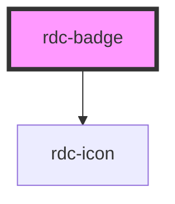

# rdc-badge

A flexible badge component that displays text and optional icons with support for multiple variants, sizes, and icon placements. Icon size automatically adjusts based on the badge size.

## Features

- Multiple size variants (sm, md, lg)
- Multiple color variants (primary, secondary, ghost, danger, warning, success, info)
- Built-in icon support with automatic sizing
- Icon placement control (before or after text)
- Full accessibility support
- Vertically centered icons and text

## Usage

### Basic Badge

```html
<rdc-badge variant="primary" label="New"></rdc-badge>
```

### Badge with Icon Before Text

```html
<rdc-badge variant="success" label="Verified" icon-name="check-circle-fill" icon-placement="before"></rdc-badge>
```

### Badge with Icon After Text

```html
<rdc-badge variant="primary" label="View" icon-name="arrow-right" icon-placement="after"></rdc-badge>
```

### Badge with Large Size and Icon

```html
<rdc-badge variant="info" size="lg" label="Featured" icon-name="star-fill"></rdc-badge>
```

<!-- Auto Generated Below -->


## Properties

| Property        | Attribute        | Description                                     | Type                                                                                  | Default     |
| --------------- | ---------------- | ----------------------------------------------- | ------------------------------------------------------------------------------------- | ----------- |
| `iconName`      | `icon-name`      | Bootstrap icon name to display in the badge.    | `string`                                                                              | `undefined` |
| `iconPlacement` | `icon-placement` | Icon placement position: before or after text.  | `"after" \| "before"`                                                                 | `'before'`  |
| `label`         | `label`          | Fallback text when no default slot is provided. | `string`                                                                              | `undefined` |
| `size`          | `size`           | Badge size.                                     | `"lg" \| "md" \| "sm"`                                                                | `'md'`      |
| `variant`       | `variant`        | Visual style of the badge.                      | `"danger" \| "ghost" \| "info" \| "primary" \| "secondary" \| "success" \| "warning"` | `'primary'` |


## Shadow Parts

| Part      | Description |
| --------- | ----------- |
| `"badge"` |             |


## Dependencies

### Depends on

- [rdc-icon](../icon)

### Graph


----------------------------------------------

*Built with [StencilJS](https://stenciljs.com/)*
