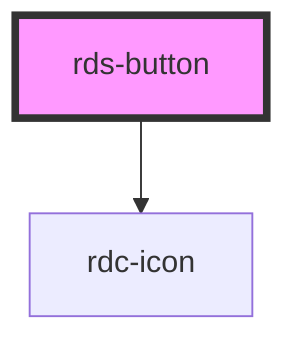

# rds-button

Design system button component.

<!-- Auto Generated Below -->

## Properties

| Property        | Attribute        | Description                                     | Type                                                                                  | Default     |
| --------------- | ---------------- | ----------------------------------------------- | ------------------------------------------------------------------------------------- | ----------- |
| `buttonType`    | `button-type`    | Native button type attribute.                   | `"button" \| "reset" \| "submit"`                                                     | `'button'`  |
| `disabled`      | `disabled`       | Disables the button.                            | `boolean`                                                                             | `false`     |
| `iconName`      | `icon-name`      | Bootstrap icon name to display in the button.   | `string`                                                                              | `undefined` |
| `iconPlacement` | `icon-placement` | Icon placement position: before or after text.  | `"after" \| "before"`                                                                 | `'before'`  |
| `label`         | `label`          | Fallback text when no default slot is provided. | `string`                                                                              | `undefined` |
| `size`          | `size`           | Button size.                                    | `"lg" \| "md" \| "sm"`                                                                | `'md'`      |
| `variant`       | `variant`        | Visual style of the button.                     | `"danger" \| "ghost" \| "info" \| "primary" \| "secondary" \| "success" \| "warning"` | `'primary'` |

## Events

| Event            | Description | Type                |
| ---------------- | ----------- | ------------------- |
| `rdsButtonClick` |             | `CustomEvent<void>` |

## Shadow Parts

| Part       | Description |
| ---------- | ----------- |
| `"button"` |             |

## Dependencies

### Depends on

- [rdc-icon](../icon)

### Graph

----------------------------------------------

*Built with [StencilJS](https://stenciljs.com/)*
