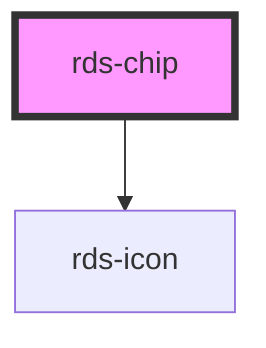

# rds-chip

Chip component for displaying small, inline elements with optional close/delete functionality. Useful for tags, filters, and selection items.

<!-- Auto Generated Below -->

## Properties

| Property         | Attribute          | Description                                     | Type                                                                                  | Default         |
| ---------------- | ------------------ | ----------------------------------------------- | ------------------------------------------------------------------------------------- | --------------- |
| `closeAriaLabel` | `close-aria-label` | ARIA label for the close button.                | `string`                                                                              | `'Remove chip'` |
| `closeIconName`  | `close-icon-name`  | Bootstrap icon name for the close button.       | `string`                                                                              | `'x-circle'`    |
| `deletable`      | `deletable`        | Show close/delete button.                       | `boolean`                                                                             | `false`         |
| `label`          | `label`            | Fallback text when no default slot is provided. | `string`                                                                              | `undefined`     |
| `size`           | `size`             | Chip size.                                      | `"lg" \| "md" \| "sm"`                                                                | `'md'`          |
| `variant`        | `variant`          | Visual style of the chip.                       | `"danger" \| "ghost" \| "info" \| "primary" \| "secondary" \| "success" \| "warning"` | `'primary'`     |

## Events

| Event          | Description                                 | Type                |
| -------------- | ------------------------------------------- | ------------------- |
| `rdsChipClose` | Event emitted when close button is clicked. | `CustomEvent<void>` |

## Shadow Parts

| Part     | Description |
| -------- | ----------- |
| `"chip"` |             |

## Dependencies

### Depends on

- [rds-icon](../icon)

### Graph

----------------------------------------------

*Built with [StencilJS](https://stenciljs.com/)*
