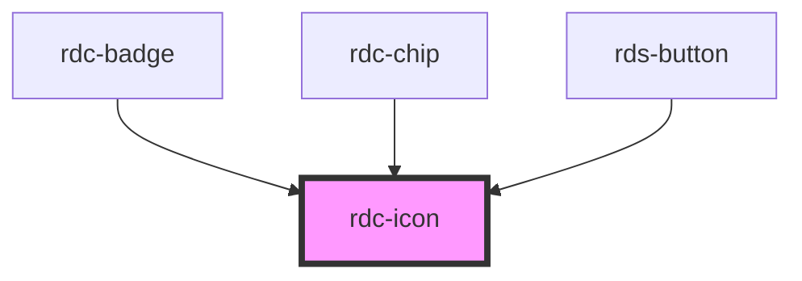

# rdc-icon

<!-- Auto Generated Below -->

## Properties

| Property            | Attribute    | Description                                | Type                                                                                    | Default     |
| ------------------- | ------------ | ------------------------------------------ | --------------------------------------------------------------------------------------- | ----------- |
| `ariaLabel`         | `aria-label` | ARIA label for accessibility.              | `string`                                                                                | `undefined` |
| `class`             | `class`      | Custom CSS class to apply to the icon.     | `string`                                                                                | `undefined` |
| `color`             | `color`      | Icon color variant.                        | `"danger" \| "info" \| "inherit" \| "primary" \| "secondary" \| "success" \| "warning"` | `'inherit'` |
| `name` _(required)_ | `name`       | The name of the bootstrap icon to display. | `string`                                                                                | `undefined` |
| `size`              | `size`       | Icon size.                                 | `"lg" \| "md" \| "sm" \| "xl" \| "xs"`                                                  | `'md'`      |

## Shadow Parts

| Part        | Description |
| ----------- | ----------- |
| `"icon"`    |             |
| `"wrapper"` |             |

## Dependencies

### Used by

 - [rdc-badge](../badge)
 - [rdc-chip](../chip)
 - [rds-button](../button)

### Graph

----------------------------------------------

*Built with [StencilJS](https://stenciljs.com/)*
